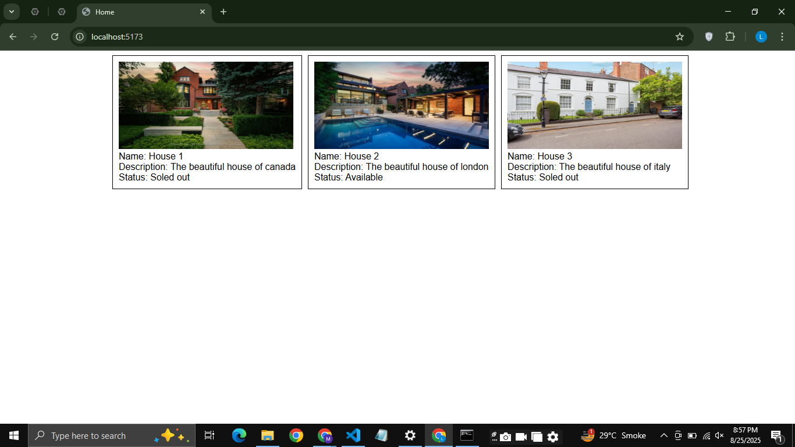

## Task 2: House Listing

Create a React component that displays a list of houses using **components, props, conditional rendering, and list & keys**.

### Requirements:
1. Use an array of objects where each object contains:
   - `id`
   - `name`
   - `image`
   - `description`
   - `status` (boolean)

2. Map over the array and render:
   - Image of the house  
   - Name of the house  
   - Description  
   - Status (show **"Sold Out"** if true, otherwise show **"Available"**)

3. Make sure each house has a **unique key**.
4. and use css for bettrer ui

---

### Example Output:

